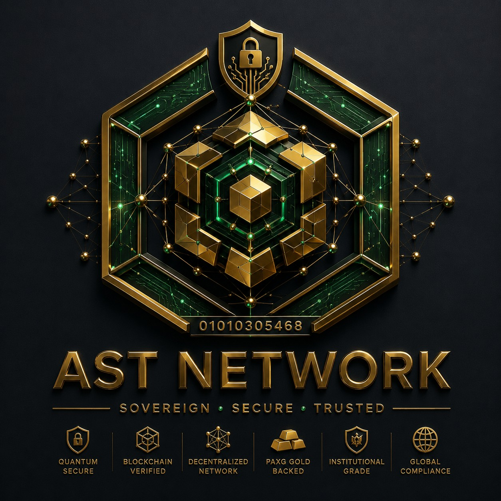

# 🌐 AST NETWORK 

<p align="center">
  
</p>

---

## 🌐 شبكة AST NETWORK (النظام المالي السيادي العابر لمحافظ البنوك والعالم)

### 🏛️ المعيار النقدي والبنكي العالمي - لعام 2026
**حقوق الملكية الفكرية والبرمجية مسجلة رسميًا - برقم قيد الحماية القانونية: 01010305468**

تُعد **AST NETWORK** أول شبكة بلوكتشين مستقلة سيادية مخصصة للمقاصة والتسويات الدولية والاعتمادات المستندية للمصانع والشركات والبنوك، مدعومة بالكامل بغطاء من أصول الذهب والودائع الاستثمارية (بدون حرق)، مع دمج بروتوكول الربط الموحد لكافة محافظ العالم الرقمية والمصرفية.

---

### 🏛️ الرؤية الاستراتيجية للشبكة
تُعد **AST NETWORK** أول شبكة بلوكتشين مستقلة سيادية في العالم مدعومة بالكامل بغطاء من الأصول الحقيقية (Layer 2 / Layer 3 AppChain). تم هندستها وتصميمها خصيصاً لتولي عمليات المقاصة والتسويات الدولية لصفقات النفط، الغاز، السلع الاستراتيجية، وتمويل بناء المدن والمشاريع المتكاملة الضخمة. تعتمد الشبكة على عملة **AST** كوقود الغاز الأساسي والحصري (Native Gas Token) لتشغيل كافة المعاملات، العقود الذكية، والعمليات التشغيلية للمنظومة، مع الحفاظ على استقرار الإمداد بالكامل وبدون آلية حرق للعملة.

### 🪙 غطاء الصناديق والأصول (هندسة الربط بالأصول الحقيقية)
تعمل الشبكة باستقرار مطلق للمعروض الإجمالي الثابت (9,041,993,000 AST) مدعومة بالكامل بـ:
1. **الذهب الرقمي العالمي (PAXG):** ربط التقييم الأساسي للشبكة والعملة مباشرة بأسعار الذهب العالمية الحية في البورصة عبر ملقمات أسعار (Chainlink Price Oracles).
2. **صندوق استثمار الأصول الحقيقية (RWA):** يتم توجيه السيولة النقدية المجمعة من جولات البيع الأولى بشكل ممنهج نحو مشاريع عقارية مدرة للأرباح، وودائع استثمارية ذات عوائد، ومشاريع تجارية حية على أرض الواقع لتغذية خزينة الحوكمة (DAO Treasury).

### 🎨 صكوك الفن الرقمي والملكية الفكرية (ASA Art)
تستضيف الشبكة **45,000 صك فني سيادي فريد (ASA)** مبرمجة ومحمية وفقاً لمعيار الحقوق التلقائية (EIP-2981)، مما يضمن تدفقاً مالياً دائماً وفورياً بنسبة **10%** كعوائد ملكية فكرية تُضخ مباشرة إلى محفظة المهندس أوسان المطور السيادية مع كل عملية تداول عابرة للشبكات.


---
### 🛠️ البيئة الهندسية والبرمجية الأساسية
* **لغة العقود الذكية:** Solidity 0.8.28
* **بيئة وإطار التطوير:** Hardhat 3 / Node.js
* **المؤسس والمهندس العام للمشروع:** المهندس أوسان عادل عبد الباري أحمد سلطان
---

## 📂 الهيكل البرمجي للمنظومة | Repository Architecture

```text
AST_NETWORK/
├── 🏛️ contracts/                     # العقود الذكية الحاكمة للشبكة (Solidity 0.8.28)
│   ├── AwsanSultanArt.sol           # عقد صكوك الفن الرقمي والملكية الفكرية (ASA - معيار EIP-2981)
│   ├── AwsanSultanGoldOracle.sol    # عقد مستشعر أسعار الذهب والاعتمادات المستندية (Chainlink Oracles)
│   ├── AwsanSultanMultiSig.sol      # عقد محفظة الحوكمة والإدارة الجماعية الثلاثية (2-of-3 Multi-Sig)
│   ├── AwsanSultanToken.sol         # عقد عملة الغاز السيادية الأساسية (AST Token - معيار ERC20 Permit)
│   ├── AwsanSultanTreasury.sol      # عقد إدارة جولات الاستثمار والـ Vesting وتقسيط الحصص
│   └── AwsanSultanVaultsManager.sol # عقد محرك الخزائن الأربعة الذكي وإدارة السيولة والمقاصة
│
├── ⚙️ scripts/                       # سكربتات التشغيل والأتمتة والنشر الدولي
│   ├── activate_vaults.js           # تفعيل الخزائن الأربعة وتدوير العقود الذكية
│   ├── airdrop_rewards_setup.js     # تهيئة معايير جولات التوزيع المجاني ومكافآت الحوامل
│   ├── asa_art_market_setup.js      # إعداد سوق صكوك الفن الرقمي ومحرك العوائد (10%)
│   ├── ast_scan_config.js           # تهيئة إعدادات واجهة مستعرض الكتل السيادي (AST SCAN)
│   ├── corporate_finance_setup.js   # أتمتة المعاملات المالية للشركات والاعتمادات المستندية للنفط
│   ├── deploy_multisig.js           # نشر وتفعيل محفظة الإدارة الجماعية الحاكمة
│   ├── final_deploy_and_link.js     # السكربت الإنشائي الشامل لمحاكاة وربط العقود الأربعة
│   ├── international_live_deploy.js # بث العقود السيادية حياً على الشبكة الدولية وربط تشينلينك
│   ├── node_validator_installer.sh  # سكربت Bash لأتمتة تركيب عُقد المصادقة وتأمين جدار الحماية
│   ├── nodes_infra_setup.js         # وثيقة المواصفات الفنية والسحابية لحماية استقرار البلوكشين
│   ├── pure_international_deploy.js # نسخة النشر الدولي النقي لإعادة البناء الفني
│   ├── sovereign_direct_deploy.js   # النشر المباشر منخفض المستوى لعملة AST باستخدام البايت كود
│   └── sync_treasury.js             # وحدة المزامنة والتحقق الأمني للخزائن السيادية
│
├── 🎨 public/                        # واجهات المستخدم الرسومية ولوحة التحكم (Frontend UI)
│   └── index.html                   # لوحة التحكم الحية الفخمة المربوطة بمؤشرات الذهب وميتا ماسك
│
├── 🛡️ الأمان والإعدادات الأساسية
│   ├── .gitignore                   # حجب الملفات السرية والمؤقتة (مثل ملفات .env المحلية)
│   ├── LICENSE                      # وثيقة حفظ الملكية الفكرية والحماية القانونية (رقم قيد: 01010305468)
│   ├── README.md                    # الدستور الفني والاقتصادي والتعريفي بالشبكة السيادية
│   ├── astnetworklogo.jpg           # الشعار البصري الرسمي الحامل للركائز الست للمشروع
│   ├── genesis.json                 # كتلة البداية (Block 0) لتأسيس البلوكشين (Chain ID: 9041993)
│   ├── hardhat.config.js            # ملف تهيئة وتعديل بيئة التطوير وتجميع العقود (Hardhat Framework)
│   ├── package.json                 # ملف إدارة الحزم والاعتماديات البرمجية الأساسية (Type: Module)
│   └── package-lock.json            # تثبيت النسخ الدقيقة للحزم لمنع الأخطاء في البيئة السحابية
└──
```


---

## 🌐 AST NETWORK (Sovereign Gold-Backed Blockchain Infrastructure)

### 🏛️ GLOBAL MONETARY CRITERIA - YEAR 2026
**Officially Registered Intellectual Property Protection ID: 01010305468**

---

### 🏛️ Strategic Network Vision
**AST NETWORK** is the world's first sovereign, asset-backed independent blockchain infrastructure (Layer 2 / Layer 3 AppChain), specifically engineered to handle global clearing settlements for oil, gas, strategic commodities, and integrated megacity developments. The network utilizes **AST** as its native fuel (Native Gas Token) to power all transactions, smart contracts, and ecosystem operations without a token-burning mechanism.

### 🪙 Vault & Capital Backing (Asset-Pegged Architecture)
The network operates with absolute supply stability (9,041,993,000 AST) completely backed by:
1. **Global Gold Tokenization (PAXG):** Linking the baseline valuation of the network directly to real-time international gold pricing via Chainlink Price Oracles.
2. **Real-World Asset (RWA) Investment Fund:** Capital accumulated through initial rounds is systematically deployed into revenue-generating real estate, yield-bearing deposits, and commercial projects to feed the DAO Treasury.

### 🎨 Tokenized Intellectual Art (ASA Art)
The network hosts **45,000 Sovereign Artistic Certifications (ASA)** coded under the (EIP-2981) royalty standard, enforcing an automatic and permanent **10%** revenue stream routed directly and instantly to the developer's core cryptographic wallet upon every cross-chain trade.

---

### 🛠️ البيئة الهندسية والبرمجية الأساسية | Core Engineering Environment

* **Smart Contract Language:** Solidity 0.8.28
* **Development Framework:** Hardhat 3 / Node.js
* **Founder & General Architect:** Eng. Awsan Adel Abdulbari Ahmed Sultan
* **Legal Protection ID:** 01010305468 / YEMEN

---
🔒 *All architectural, institutional, and technical banking rights are exclusively reserved.*


---

## 📂 Repository Architecture | الهيكل البرمجي للمنظومة

```text
AST_NETWORK/
├── 🏛️ contracts/                     # Sovereign Smart Contracts (Solidity 0.8.28)
│   ├── AwsanSultanArt.sol           # Sovereign Art & IP Certifications Contract (ASA - EIP-2981 Standard)
│   ├── AwsanSultanGoldOracle.sol    # Real-Time Gold Price Sensor & Smart Trade Finance (Chainlink Oracles)
│   ├── AwsanSultanMultiSig.sol      # Tri-Signature Governance & Institutional Wallet (2-of-3 Multi-Sig)
│   ├── AwsanSultanToken.sol         # Native Sovereign Gas Currency Contract (AST Token - ERC20 Permit Standard)
│   ├── AwsanSultanTreasury.sol      # Investment Rounds Management, Vesting Programs & Distribution Setup
│   └── AwsanSultanVaultsManager.sol # Smart Engine for the Four Sovereign Vaults, Liquidity & Clearing Management
│
├── ⚙️ scripts/                       # Deployment, Automation & Global Broadcasting Scripts
│   ├── activate_vaults.js           # Activates the four core vaults and rotates smart contract configurations
│   ├── airdrop_rewards_setup.js     # Configures ecosystem automated airdrop distributions and holder rewards
│   ├── asa_art_market_setup.js      # Deploys the sovereign ASA NFT marketplace and activates the 10% IP royalty engine
│   ├── ast_scan_config.js           # Initializes configurations for the sovereign block explorer UI (AST SCAN)
│   ├── corporate_finance_setup.js   # Automates business payrolls and trade finance structures for oil & gas contracts
│   ├── deploy_multisig.js           # Deploys and activates the central multi-signature cryptographic governance vault
│   ├── final_deploy_and_link.js     # Comprehensive deployment script to simulate, compile, and interconnect all 4 core contracts
│   ├── international_live_deploy.js # Broadcasts sovereign contracts live to international chains and links production Chainlink feeds
│   ├── node_validator_installer.sh  # Automated Linux Bash script to install validator nodes and configure rigorous UFW firewalls
│   ├── nodes_infra_setup.js         # Technical specifications document for bare-metal servers protecting blockchain stability
│   ├── pure_international_deploy.js # Clean production deployment script blueprint for isolated technical redeployments
│   ├── sovereign_direct_deploy.js   # Low-level direct broadcasting script injecting pre-compiled AST Token bytecode via Alchemy
│   └── sync_treasury.js             # Cryptographic synchronization module and active validation engine for the asset vaults
│
├── 🎨 public/                        # Graphical Frontend Interfaces & Institutional Web3 Dashboards
│   └── index.html                   # High-grade real-time web interface connecting MetaMask to global gold indexes
│
├── 🛡️ Project Configurations & Security Baselines
│   ├── .gitignore                   # Rigorous rules protecting local environment configuration keys (*.env) from being exposed
│   ├── LICENSE                      # IP Protection, Global Banking Compliance, & Legally Registered Patent (Ref: 01010305468)
│   ├── README.md                    # The official technical, economic, and sovereign architectural constitution of the network
│   ├── astnetworklogo.jpg           # Official brand asset displaying the six immutable technical pillars of the ecosystem
│   ├── genesis.json                 # Core Genesis Block config setting up independent EVM parameters (Chain ID: 9041993)
│   ├── hardhat.config.js            # Hardhat environment configuration file enforcing Solidity optimizer sets at 200 cycles
│   ├── package.json                 # Node.js manifest handling modern ES modules (Type: Module) and foundational toolchains
│   └── package-lock.json            # Lockfile securing exact dependency trees to guarantee deterministic builds on Cloud Shell
└──
```


